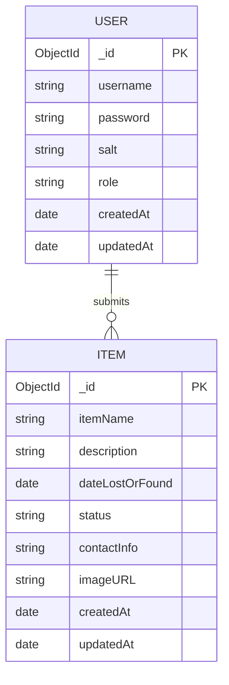

# Lost & Found @ TIP Manila

A web application for managing lost and found items at TIP Manila, built with Node.js, Express, and MongoDB.

---

## Table of Contents
- [Features](#features)
- [Technology Stack](#technology-stack)
- [System Architecture](#system-architecture)
- [Data Flow](#data-flow)
- [Database Design (ERD)](#database-design-erd)
- [API Reference](#api-reference)
- [Security](#security)
- [Local Development](#local-development)
- [CI/CD Pipeline](#cicd-pipeline)
- [Testing](#testing)

---

## Features
- Register and log in with JWT-based authentication
- Post lost or found items with descriptions and images
- Search and filter items by name or status
- Mark items as claimed (authenticated users)
- Delete items (admin only)
- Role-based access control (user / admin)
- Input validation and secure file upload handling
- HTTP request logging via Morgan

---

## Technology Stack

| Layer      | Technology |
|------------|------------|
| Frontend   | HTML, CSS, Vanilla JavaScript |
| Backend    | Node.js, Express.js |
| Database   | MongoDB (Mongoose ODM) |
| Auth       | JSON Web Tokens (JWT), PBKDF2 hashing |
| Validation | express-validator |
| Logging    | Morgan (file + console) |
| File upload| Multer (images only, max 5 MB) |
| DevOps     | Docker, docker-compose, Render, GitHub Actions |

---

## System Architecture

```
┌─────────────────────────────────────────────────────────────┐
│                     Client (Browser)                        │
│       HTML / CSS / Vanilla JS  ─  FRONTEND/index.html       │
└────────────────────────┬────────────────────────────────────┘
                         │  HTTP (REST)
                         ▼
┌─────────────────────────────────────────────────────────────┐
│                   Express.js Backend                        │
│                                                             │
│  ┌─────────────┐  ┌──────────────┐  ┌──────────────────┐  │
│  │ Middleware   │  │   Routes     │  │  Controllers     │  │
│  │─────────────│  │──────────────│  │──────────────────│  │
│  │ Morgan log  │  │ /api/auth    │  │ authController   │  │
│  │ CORS guard  │  │ /api/items   │  │ itemController   │  │
│  │ JWT verify  │  │              │  │                  │  │
│  │ Validation  │  │              │  │                  │  │
│  │ Multer      │  │              │  │                  │  │
│  └─────────────┘  └──────────────┘  └──────────────────┘  │
└────────────────────────┬────────────────────────────────────┘
                         │  Mongoose ODM
                         ▼
┌─────────────────────────────────────────────────────────────┐
│                        MongoDB                              │
│              Collections: users  /  items                   │
└─────────────────────────────────────────────────────────────┘
```

---

## Data Flow

### Authenticated write (POST /api/items)

```
Browser
  │
  1. POST /api/items  (FormData + Authorization: Bearer <token>)
  │
  ▼
Morgan  →  logs to logs/access.log
  ▼
CORS  →  validates Origin header
  ▼
authenticate()  →  verifies JWT, attaches req.user
  ▼
Multer  →  validates file type/size, saves to /uploads
  ▼
validateItem()  →  express-validator checks all fields
  ▼
itemController.postItem()  →  saves Item to MongoDB
  ▼
201 JSON response  →  back to browser
```

### Public read (GET /api/items)

```
Browser  →  GET /api/items?status=lost
  →  Morgan log
  →  itemController.getItems()  →  MongoDB query
  →  200 JSON array  →  browser
```

---

## Database Design (ERD)



> `status` enum: `lost | found | claimed`
> `role` enum: `user | admin`

---

## API Reference

### Auth (public)

| Method | Endpoint             | Body                     |
|--------|----------------------|--------------------------|
| POST   | /api/auth/register   | { username, password }   |
| POST   | /api/auth/login      | { username, password }   |

Response: `{ token, username, role }`

---

### Items

| Method | Endpoint         | Auth         | Description                              |
|--------|------------------|--------------|------------------------------------------|
| GET    | /api/items       | None         | List items (`?status=lost&q=umbrella`)   |
| POST   | /api/items       | User token   | Submit item (multipart/form-data)        |
| PATCH  | /api/items/:id   | User token   | Update status                            |
| DELETE | /api/items/:id   | Admin token  | Delete item                              |

**POST fields:** itemName, description, dateLostOrFound (ISO 8601), status (lost/found), contactInfo, image (optional, image files only, max 5 MB)

**PATCH body:** `{ "status": "claimed" }`

### Status codes

| Code | Meaning |
|------|---------|
| 200  | OK |
| 201  | Created |
| 204  | Deleted |
| 401  | Unauthorized |
| 403  | Forbidden (wrong role) |
| 409  | Duplicate username |
| 422  | Validation error |

---

## Security

| Mechanism         | Implementation |
|-------------------|----------------|
| Authentication    | JWT, 8h expiry |
| Password hashing  | PBKDF2 + per-user salt (Node.js crypto) |
| RBAC              | requireRole('admin') on DELETE |
| Input validation  | express-validator, .escape() on text fields |
| File uploads      | MIME + extension check, 5 MB cap |
| CORS              | Allowlist via ALLOWED_ORIGINS env var |
| Secrets           | .env only, never committed |

---

## Local Development

```bash
git clone https://github.com/Qons1/appdevproj.git
cd appdevproj/BACKEND
cp .env.example .env      # fill in MONGO_URI and JWT_SECRET
npm install
npm start                 # or: npm run dev
```

Open http://localhost:5000

---

## CI/CD Pipeline

`.github/workflows/ci.yml` triggers on every push to `main` or `develop`:

```
push to GitHub
      │
      ▼
  [test job]
  - start MongoDB service container
  - npm ci
  - npm test (15 integration tests)
      │ pass
      ▼
  [build job]  (main branch only)
  - docker build
  - smoke-test: container starts successfully
      │ pass
      ▼
  [deploy job]  (main branch only)
  - POST to Render deploy hook  →  live on Render
```

Set `RENDER_DEPLOY_HOOK_URL` as a GitHub repository secret to enable auto-deploy.

---

## Testing

### Automated tests

```bash
cd BACKEND
npm test
```

`tests/api.test.js` — 15 integration test cases:
- Auth: register, duplicate rejection, weak password, login, wrong password
- GET /api/items: public access, status filter
- POST /api/items: success, 401 without token, 422 invalid status, 422 missing fields
- PATCH /api/items/:id: success, 401 without token
- DELETE /api/items/:id: 401 no token, 403 non-admin, 204 admin success

### Postman

Import `postman_collection.json` from the repo root.
Set `base_url` to `http://localhost:5000`.
Run **Auth → Register** or **Auth → Login** first — the JWT token is auto-saved and used by all other requests.
